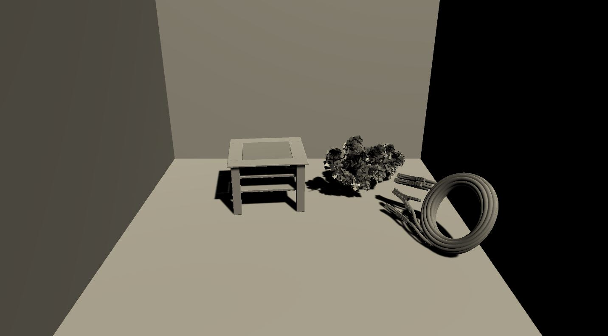
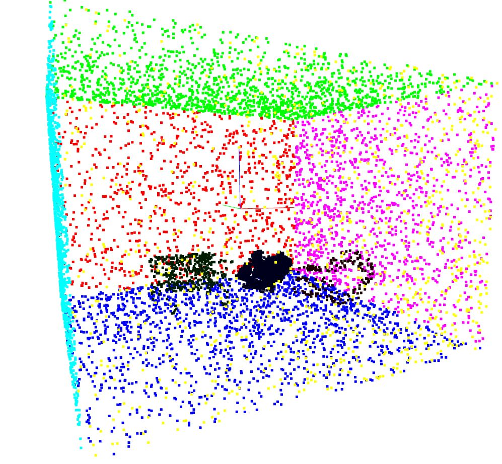

# Point Cloud Data Generator

Point clouds are generated from mesh scenes. A detailed documentation will follow soon. 
The project was developed in context of the [smart segmentation](https://github.com/mati3230/smartsegmentation) project. 
The generated point clouds can be used in the [segmentation environment](https://github.com/mati3230/segmentation). The Compositor is developed and is tested under Windows 10, as [Unity](https://unity.com/) with the [TriLib](https://assetstore.unity.com/packages/tools/modeling/trilib-model-loader-package-91777) is used to create the mesh scenes. 

## Requirements

The code is test on python 3.6 and 3.7 and [Unity](https://unity.com/) 2019.3.0a7. 

* [Mozilla Firefox](https://www.mozilla.org/de/exp/firefox/new/)
* [Unity](https://unity.com/) 2019.3.0a7
* [Pyntcloud](https://github.com/mati3230/pyntcloud)
* Selenium
* Numpy
* Scipy
* Pandas
* Matplotlib
* Requests
* Pyunpack
* Patool
* [TriLib](https://assetstore.unity.com/packages/tools/modeling/trilib-model-loader-package-91777)

## Installation

Download and install [Mozilla Firefox](https://www.mozilla.org/de/exp/firefox/new/) and [Unity](https://unity.com/) 2019.3.0a7. 
The python requirements can be installed via pip: 

*pip install -r requirements.txt*

[Pyntcloud](https://github.com/mati3230/pyntcloud) has to be installed seperately.

1. Clone https://github.com/mati3230/pyntcloud.git
2. pip install -e ./pyntcloud

To run and build the [Unity](https://unity.com/) Project in the directory "./scene_compositor", the [TriLib](https://assetstore.unity.com/packages/tools/modeling/trilib-model-loader-package-91777) library has to be acquired and to be integrated into the project.

## Usage

The scene_compositor project has to be opened with [Unity](https://unity.com/). A build of the scene_compositor project should be placed in *./scene_compositor/Build/Compositor/Compositor.exe*. The corresponding scene for the build is *./scene_compositor/Assets/Scenes/Compositor.unity*. 

After the scene is build, the objs_dir of the parameters below has also to be specified in a .txt file in the StreamingAssets folder. You can find the StreamingAssets folder in the directory where the *Compositor.exe* is placed: *Compositor_Data/StreamingAssets*. There is a file called *ObjectsDirectory.txt*. Here you can specify the objs_dir of the parameters below. 

The object categories which should be downloaded can be specified in the [categories.txt](categories.txt) file. The heights of a category or subcategory can be specified in the [heights.csv](heights.csv) file. The first column represents the category and the second the subcategory. The third and fourth column specify the minimum and maximum scale. If a value of the first column is equal to a value of the second one, the row will be used as fallback if the subcategory does not exist. 

The point cloud generation process can be started with:

*python build_database.py*

The parameteres of the build_database script can be printed with the *-h* option and are listed below: 

|Parameter|Description|Type|Default|
|-|-|-|-|
| --objs_dir | Directory where the 'PointcloudScenes' is located/will be created. This directory will be created if it not exists.  | str | ./objects |
| --compositor_dir | Directory to the builded scene_compositor program. | str | ./scene_compositor/Build/Compositor/Compositor.exe |
| --conversion_only | If 'True', only a conversion of the mesh scenes to point clouds will be conducted and the download will be skipped. | bool | False |
| --max_points | Determines the maximum number of points in the resulting point clouds. | int | 10000 |
| --debug | If 'True', the unity compositor can be started from the unity editor. | bool | False |

In order to stop the database generation, you have to kill the Compositor program and the build_database program. 
After the database generation, you may want to remove some points from the point cloud that are far away from the room. These points occur due to some shapes of some models that are huge. To clean the scenes, call: 

*python clean_scenes.py*

With the *--objs_dir* option, you can specify the directory where the PointcloudScenes folder is located. With the *--max_dim* option, you can throw away points that have a spatial coordinate (x,y,z) greater than max_dim. 

An example scene is depicted below: 

The scene was transformed to the following point cloud: 

## scene_compositor Parameters

The following parameters appear in the Unity inspector and can be changed by the user. 

|Parameter|Description|
| - | - |
| Room Widths | Min and max width of the rooms |
| Room Heights | Min and max height of the rooms |
| Room Depths | Min and max depth of the rooms |
| Sep | Seperation character of the csv files |
| N Objects | Min and max number of objects in the scene |
| Scale Margin | If an object has more width and depth then the ones of the room, the object is scaled to the room size with taking this margin into account |
| Max Angles | Max magnitude of the angles in the corresponding axis of a random rotation of an object |
| Max Renderer | Maximum nr of renderer of a model |
| Mesh Collider | If false, objects will be attached with box colliders |
| Gravity Duration | How long will be gravity applied till the scene will be exported? |
| Use Tcp | Will send message when .ply data is exported. If false, just one loop of .ply exportation will be conducted. |
| Ip Address | IP of the program which transforms .ply files to .csv point cloud |
| Port | Port of the program which transforms .ply files to .csv point cloud |
| N Scenes | How many scenes should be created |

## Citation

If you use this repository, please use the following citation:

@inproceedings{
	
	Tiator2020,

	address = {Santiago de Compostela, Spain},
	
	author = {Tiator, Marcel and Geiger, Christian and Grimm, Paul},
	
	booktitle = {Proceedings of the 24th European Conference on Artificial Intelligence - ECAI '20},
	
	publisher = {IOS Press},
	
	title = {{Point Cloud Segmentation with Deep Reinforcement Learning}},
	
	url = {http://ecai2020.eu/papers/1345{\_}paper.pdf},
	
	year = {2020}
	
}

## Acknowledgements

This project is sponsored by: German Federal Ministry of Education and Research (BMBF) under the project number 13FH022IX6. Project name: Interactive body-near production technology 4.0 (German: Interaktive körpernahe Produktionstechnik 4.0 (iKPT4.0))

